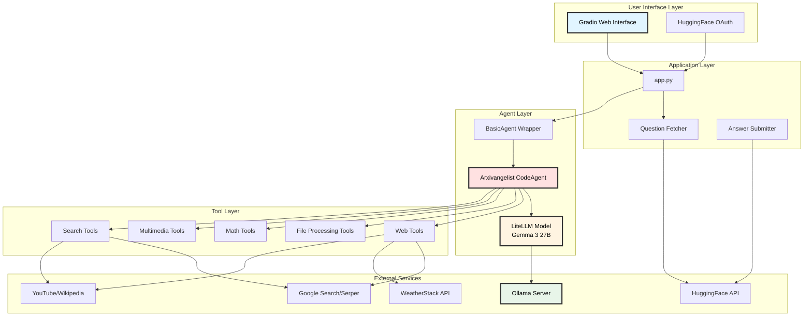

# Arxivangelist Multi-Task AI Agent

[](https://huggingface.co/spaces/baloglu321/arxivangelist-multitask-ai)
[](https://www.python.org/downloads/)
[](LICENSE)

> **Note**: This project was developed as part of the [HuggingFace Agents Course Unit 4](https://huggingface.co/learn/agents-course/unit4/hands-on) final assignment. The evaluation server is currently offline, so the submission functionality is no longer active.

## 🎯 Project Overview

Arxivangelist is an advanced multi-task AI agent system designed to answer diverse questions spanning multiple domains including mathematics, web research, document processing, multimedia analysis, and more. The agent achieved a **30% accuracy rate (6 out of 20 correct answers)** on the GAIA benchmark evaluation, ranking **3741st** on the leaderboard.

### Key Achievement
- ✅ Successfully passed the 30% accuracy threshold requirement
- 🏆 Ranked 3743st on the HuggingFace Agents Course leaderboard
- 🎓 Completed as part of the HuggingFace Agents Course Unit 4

## 🎬 Demo


*Screenshot showing the agent's performance on various task types including chess moves, trivia questions, and mathematical operations.*

## 🏗️ Architecture



## ✨ Features

### 🔧 Comprehensive Tool Arsenal

The agent is equipped with **25+ specialized tools** across multiple categories:

#### 🌐 Web & Search Tools
- **GoogleSearchTool**: Advanced web search via Serper API
- **WikiSearchTool**: Wikipedia knowledge retrieval
- **ArxivSearchTool**: Academic paper search
- **WebScrapingTool**: Web page content extraction
- **VisitWebpageTool**: Direct webpage access

#### 📊 Data Processing Tools
- **DataProcessingTool**: Excel/CSV data manipulation
- **PythonInterpreterTool**: Dynamic Python code execution
- **FileDownloadTool**: Multi-format file handling (MP3, XLSX, JSON, images)

#### 🎥 Multimedia Tools
- **YouTubeDownloadTool**: Video download via yt-dlp
- **YouTubeTranscriptTool**: Subtitle extraction
- **TranscriberTool**: Audio-to-text transcription (Whisper)
- **SpeechToTextTool**: Real-time speech recognition
- **ImageCaptionerTool**: Visual content analysis

#### 🔢 Mathematical Tools
- Basic operations: Add, Subtract, Multiply, Divide
- Advanced operations: Power, Square Root, Logarithm, Modulus
- Full floating-point precision support

#### 🌤️ Specialized Tools
- **WeatherInfoTool**: Real-time weather data
- **FinalAnswerTool**: Structured response formatting

## 🚀 Getting Started

### Prerequisites

- Python 3.10 or higher
- Ollama server (local or remote)
- API keys for external services

### Installation

1. **Clone the repository**
```bash
git clone https://github.com/baloglu321/arxivangelist-multitask-ai.git
cd arxivangelist-multitask-ai
```

2. **Install dependencies**
```bash
pip install -r requirements.txt
```

3. **Set up Ollama**
```bash
# Install Ollama (if not already installed)
curl https://ollama.ai/install.sh | sh

# Pull the model
ollama pull gemma3:27b
```

4. **Configure API keys**

Edit `agent.py` and add your API keys:
```python
os.environ["WEATHER_API"] = "your_weatherstack_api_key"
os.environ["SERPER_API_KEY"] = "your_serper_api_key"
ollama_server = "http://localhost:11434"  # Your Ollama server URL
```

5. **Customize system prompt** (optional)

Edit `system_prompt.txt` to adjust the agent's behavior.

### Running the Application

#### Local Gradio Interface
```bash
python app.py
```

Then open your browser at `http://localhost:7860`

#### HuggingFace Space Deployment
The application is configured for HuggingFace Spaces deployment. Simply push your code to a HuggingFace Space repository.

## 📖 Usage

### Web Interface

1. **Login**: Click the "Login with HuggingFace" button
2. **Run Evaluation**: Click "Run Evaluation & Submit All Answers"
3. **View Results**: Check the status panel and results table

### Programmatic Usage

```python
from agent import build_agent

# Initialize the agent
agent = build_agent()

# Ask a question
question = "What is the capital of France?"
answer = agent.run(question)
print(answer)
```

### Example Questions

The agent can handle diverse question types:

```python
# Mathematical reasoning
"Calculate the square root of 144 then multiply by 7"

# Web research
"Who won the Nobel Prize in Physics in 2023?"

# Chess analysis
"Review this chess position and provide the best move for black in algebraic notation"

# Data analysis
"Download the Excel file with task ID xyz and tell me the average of column B"

# Multimedia processing
"Transcribe the audio file associated with task ID abc"
```

## 🛠️ Technical Details

### Core Components

#### 1. Agent Architecture (`agent.py`)

The main agent is built using the `smolagents` framework with a `CodeAgent` orchestrator:

```python
Arxivangelist = CodeAgent(
    tools=tool_list,
    model=LiteLLMModel(...),
    additional_authorized_imports=["requests", "json", "re", "subprocess", "pandas", "cv2", "PIL"],
    add_base_tools=False,
    planning_interval=5
)
```

**Key Features:**
- **Dynamic tool selection**: Agent autonomously chooses appropriate tools
- **Code generation**: Can write and execute Python code on-the-fly
- **Multi-step reasoning**: Plans and executes complex multi-tool workflows
- **Error handling**: Gracefully handles tool failures and retries

#### 2. LLM Backend

- **Model**: Gemma 3 27B (via Ollama)
- **Context Window**: 8192 tokens
- **Provider**: LiteLLM with Ollama integration
- **Temperature**: Configurable via system prompt

#### 3. Gradio Interface (`app.py`)

Features:
- OAuth authentication with HuggingFace
- Batch question processing
- Real-time status updates
- Results table with task details
- Automatic submission to evaluation server

### Tool Implementation Pattern

All tools follow a consistent interface:

```python
class CustomTool(Tool):
    name = "tool_name"
    description = "What this tool does"
    inputs = {
        "param": {
            "type": "string|number",
            "description": "Parameter description"
        }
    }
    output_type = "string|number"
    
    def forward(self, param):
        # Tool logic here
        return result
    
    def __call__(self, param):
        return self.forward(param)
```

## 📊 Performance Analysis

### Results Breakdown

| Category | Questions | Correct | Accuracy |
|----------|-----------|---------|----------|
| Total | 20 | 6 | 30.0% |
| Valid Tasks | 20 | 6 | 30.0% |

### Sample Successful Tasks

1. ✅ **Chess move calculation** (Task: 2d83118e-a698-4ebb-9987-866c86fa42d0)
   - Question: Encrypted chess position analysis
   - Answer: `Qb8#` (correct)

2. ✅ **Trivia question** (Task: 4fc2f1ae-8625-46b5-ab34-ad4433bc21f8)
   - Question: "Who nominated the only Featured Article on English Wikipedia about a dinosaur that was promoted in November 2016?"
   - Answer: `FunkMonk` (correct)

### Performance Insights

**Strengths:**
- ✅ Pattern recognition and text processing
- ✅ Mathematical calculations
- ✅ Web search and information retrieval
- ✅ File download and basic parsing

**Areas for Improvement:**
- ⚠️ Complex multi-step reasoning tasks
- ⚠️ Ambiguous question interpretation
- ⚠️ Context-dependent questions requiring deep domain knowledge
- ⚠️ Tasks requiring multiple tool orchestrations

## 🔧 Configuration

### Environment Variables

```bash
# API Keys
WEATHER_API=your_weatherstack_key
SERPER_API_KEY=your_serper_key

# HuggingFace Space (auto-configured)
SPACE_HOST=your-space.hf.space
SPACE_ID=username/space-name
```

### Model Configuration

Edit `agent.py` to change the model:

```python
model_id = "gemma3:27b"  # Change to your preferred model
ollama_server = "http://localhost:11434"  # Your Ollama server
```

### System Prompt

The agent behavior is controlled via `system_prompt.txt`. Key aspects:

```
You are a helpful assistant tasked with answering questions using a set of tools.
Report your thoughts, and finish with: FINAL ANSWER: [YOUR FINAL ANSWER]

Rules:
- Numbers: no commas, no units unless specified
- Strings: no articles, no abbreviations, plain text digits
- Lists: comma separated, apply above rules per element
```

## 🐛 Known Limitations

1. **Evaluation Server Offline**: The HuggingFace evaluation server no longer accepts submissions
2. **API Dependencies**: Requires external API keys for full functionality
3. **Resource Intensive**: Gemma 3 27B requires significant compute resources
4. **Rate Limits**: External APIs may have rate limiting
5. **Audio Processing**: Large audio files may timeout or fail

## 🔮 Future Improvements

### Planned Enhancements

- [ ] **Caching system**: Store intermediate results to speed up retries
- [ ] **Async processing**: Handle multiple questions concurrently
- [ ] **Enhanced error recovery**: Better fallback mechanisms
- [ ] **Tool optimization**: Reduce redundant tool calls
- [ ] **Model fine-tuning**: Train on GAIA dataset for better performance
- [ ] **Lightweight alternative**: Support for smaller models (Gemma 2B/7B)
- [ ] **Advanced reasoning**: Implement chain-of-thought prompting
- [ ] **Memory system**: Maintain context across multiple questions

### Potential New Tools

- PDF text extraction tool
- Database query tool
- Code analysis/debugging tool
- Real-time collaboration tool
- Advanced chart/graph generation

## 📚 Dependencies

### Core Libraries
- `smolagents`: Agent framework
- `gradio`: Web interface
- `litellm`: LLM abstraction layer
- `pandas`: Data processing
- `whisper`: Audio transcription
- `opencv-python`: Image processing
- `yt-dlp`: YouTube video download

### External APIs
- Ollama (LLM inference)
- Serper API (web search)
- WeatherStack API (weather data)
- HuggingFace Hub (model hosting)

See `requirements.txt` for complete list.

## 🤝 Contributing

While this project was completed for a course assignment, contributions and improvements are welcome!

1. Fork the repository
2. Create a feature branch (`git checkout -b feature/amazing-feature`)
3. Commit your changes (`git commit -m 'Add amazing feature'`)
4. Push to the branch (`git push origin feature/amazing-feature`)
5. Open a Pull Request

## 📄 License

This project is open source and available under the MIT License.

## 🙏 Acknowledgments

- **HuggingFace** for the Agents Course and evaluation infrastructure
- **Anthropic** for the Claude model (used for documentation)
- **Google** for the Gemma models
- **Smolagents** team for the excellent agent framework
- All contributors to the open-source libraries used

## 📞 Contact

- **GitHub**: [@baloglu321](https://github.com/baloglu321)
- **HuggingFace**: [@baloglu321](https://huggingface.co/baloglu321)

## 📖 References

- [HuggingFace Agents Course](https://huggingface.co/learn/agents-course)
- [Smolagents Documentation](https://github.com/huggingface/smolagents)
- [GAIA Benchmark Paper](https://arxiv.org/abs/2311.12983)
- [Gemma Model Card](https://huggingface.co/google/gemma-3-27b)

---

**⚠️ Important Note**: This project was designed for educational purposes as part of the HuggingFace Agents Course Unit 4. The evaluation server is no longer active, so the submission functionality will not work. However, the agent system itself is fully functional for local use and can be adapted for other multi-task AI applications.
